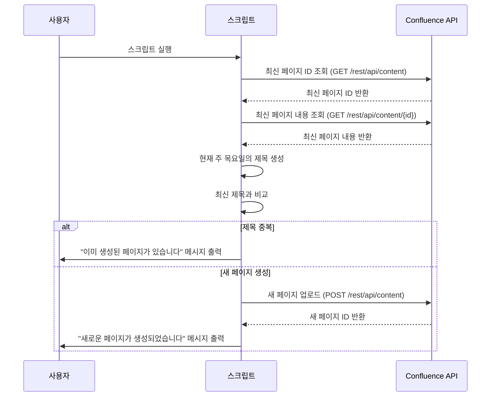

# 주간 보고 자동화 스크립트

이 스크립트는 Confluence에서 주간 보고서를 자동으로 생성하는 작업을 수행합니다. 최신 보고서를 기반으로 현재 주의 목요일에 해당하는 제목으로 업데이트하고, 새로운 보고서를 생성합니다.

---

## 주요 기능

1. **최신 보고서 페이지 가져오기**  
   - 지정된 루트 페이지에서 최신 보고서 페이지의 ID를 가져옵니다.

2. **최신 보고서 내용 조회**  
   - 최신 보고서 페이지의 내용을 조회합니다.

3. **현재 주 목요일 기준으로 제목 업데이트**  
   - 최신 보고서 제목을 기준으로 현재 주의 목요일 날짜를 포함한 제목을 생성합니다.

4. **새로운 보고서 페이지 업로드**  
   - 수정된 제목과 내용을 기반으로 새로운 페이지를 Confluence에 업로드합니다.

5. **중복 확인**  
   - 이미 이번 주 목요일에 해당하는 제목의 페이지가 존재하면 새 페이지를 생성하지 않고 종료합니다.

---

## 스크립트 실행 과정

### 순서도 (Mermaid)



---

## 코드 주요 로직

1. **최신 페이지 조회**  
   루트 페이지 ID를 사용하여 최신 보고서의 ID를 가져옵니다.

   ```python
   latest_page = latest_page_getter.get(ROOT_PAGE_ID)
   ```

2. **최신 페이지 내용 조회**  
   최신 페이지의 ID로 해당 페이지의 내용을 조회합니다.

   ```python
   latest_content = content_getter.get(latest_page.id)
   ```

3. **현재 주 목요일 제목 생성**  
   `get_this_week_thursday_title` 함수를 사용하여 목요일 날짜를 기반으로 제목을 생성합니다.

   ```python
   this_week_thursday_title = get_this_week_thursday_title(latest_content.title)
   ```

4. **중복 확인 및 처리**  
   최신 페이지 제목이 이미 이번 주 목요일 제목과 동일한 경우 생성하지 않습니다.

   ```python
   if latest_content.title == this_week_thursday_title:
       logger.info("이미 존재하는 페이지입니다.")
       exit(0)
   ```

5. **새 페이지 업로드**  
   수정된 제목으로 새로운 페이지를 생성합니다.

   ```python
   latest_content.title = this_week_thursday_title
   new_page = content_adder.post(latest_content)
   ```

---

## 로그 예시

### 정상 동작
```json
{
    "level": "INFO",
    "time": "2024-12-05 11:30:00",
    "message": "새 페이지가 생성되었습니다: https://confluence.nexon.com/pages/viewpage.action?pageId=123456",
    "name": "jsonLogger"
}
```

### 제목 중복
```json
{
    "level": "INFO",
    "time": "2024-12-05 11:31:00",
    "message": "이미 존재하는 페이지입니다: https://confluence.nexon.com/pages/viewpage.action?pageId=123456",
    "name": "jsonLogger"
}
```

### 에러 발생
```json
{
    "level": "ERROR",
    "time": "2024-12-05 11:32:00",
    "message": "스크립트 실행 중 예외가 발생했습니다: 제목에서 날짜를 찾을 수 없습니다",
    "exception": "Traceback (most recent call last):\n...",
    "name": "jsonLogger"
}
```

---

## 환경 변수 및 설정

1. **`TOKEN`**  
   Confluence API에 인증하기 위한 Bearer Token.

2. **`ROOT_PAGE_ID`**  
   루트 페이지의 ID. 최신 보고서를 가져오는 기준이 되는 페이지.

3. **`CONFLUENCE_BASE_URL`**  
   Confluence API의 기본 URL.

4. **`WEEKLY_REPORT_WEBHOOK_URL`**
   Slack Webhook 트리거 URL

---

## 실행 방법

```bash
pip install -r requirements.txt
python weekly_report.py
```

- 스크립트 실행 시, 필요한 환경 변수와 설정이 제대로 구성되어 있어야 합니다.

---

추가 요청이나 수정 사항이 있다면 말씀해주세요!
